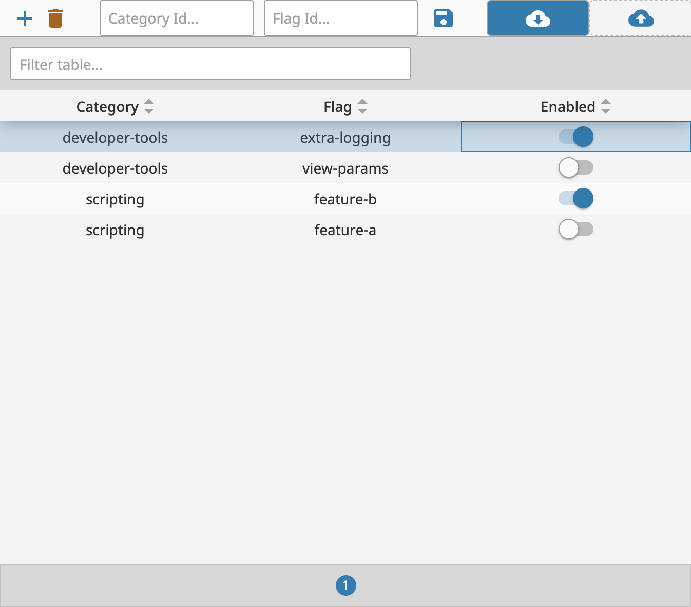

## Feature Flagging
The script module `General.FeatureFlags` adds in a variety of different ways to flag features in your code. This is useful for testing, debugging, or for hiding features from users until they are ready to be released.


#### `@General.FeatureFlags.if_enabled`
The `if_enabled` decorator can be used to wrap a function. If the feature flag is enabled, the function will be called. If the feature flag is disabled, the function will not be called. This is useful for wrapping functions that may need to be disabled in production if bugs are identified.

The `if_enabled` flag takes three parameters:
* `category_id` - The category of the feature flag. This is used to group feature flags together. This is a string.
* `flag_id` - The name of the feature flag. This is a string.
* `old_func` - A reference to a legacy version of a function, this is incase you are updating an existing feature, and you might need to disable the new functionality in prod without rolling back the code. 


##### Simple Example
```python
@General.FeatureFlags.if_enabled("scripting", "myFeature")
def myFunction():
    print("Hello World")

```

If `scripting.myFeature` is enabled, when the function is called it will print "Hello World". If it is disabled, the function will be skipped over, and nothing will print.


##### Example with Legacy Function
```python
def myOldFunction():
    print("Hello World")

@General.FeatureFlags.if_enabled("scripting", "myFeature", old_func=myOldFunction)
def myFunction():
    print("Goodbye World")
```

If `scripting.myFeature` is enabled, when the function is called it will print "Goodbye World". If it is disabled, the function will be skipped over, and the legacy function will be called, printing "Hello World".

#### Example with hiding view functionality
In a Perspective view, you can use a binding with a `runScript` expression to call the `isEnabled` function provided in the `General.FeatureFlags` module. This can be used to hide or show functionality in a view.

```python
runScript("General.FeatureFlags.is_feature_enabled", 5000, "development-features", "hidden-feature")
```

If the functionality being hidden is a bit _"heavier"_ on the view, you can use an embedded view to keep the functionality from ever rendering to the webpage in the first place.

Using a binding similar to above, with a map transform to keep the viewPath from being provided to the component, then it wont load the view at all.

Here is an example binding that can be pasted to the `viewPath` of an embedded view.
```json
{
  "type": "expr",
  "config": {
    "expression": "runScript(\"General.FeatureFlags.is_feature_enabled\", 5000, \"development-features\", \"my-feature\")"
  },
  "transforms": [
    {
      "inputType": "scalar",
      "outputType": "scalar",
      "mappings": [
        {
          "input": true,
          "output": "myView/myPath"
        }
      ],
      "fallback": "",
      "type": "map"
    }
  ]
}
```

### Feature Flag Viewer
This project contains a feature flag editor, located under `Utilities/Feature Flag Editor`. It includes the capability to view, upload, download, and customize the feature flag file located on the gateway.


