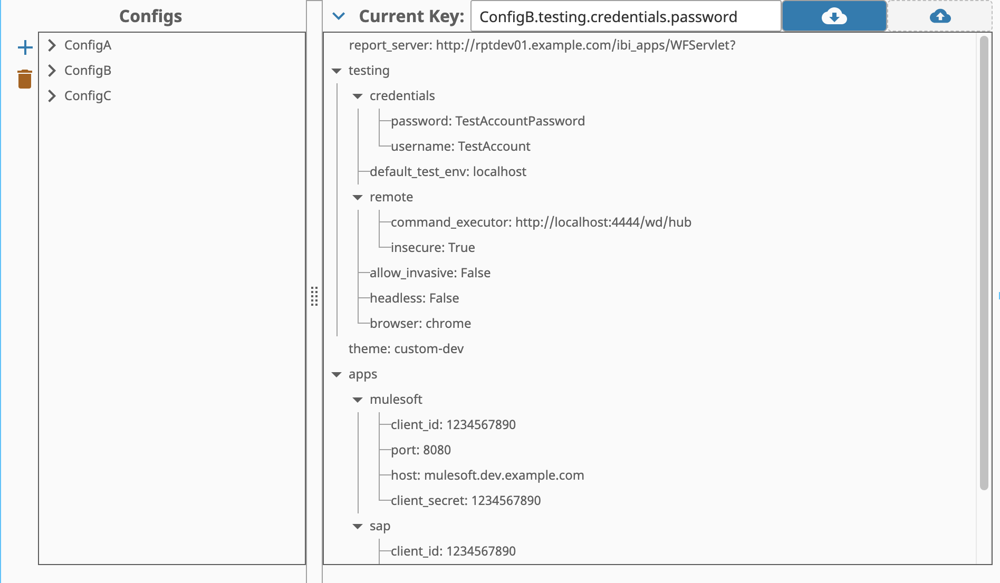
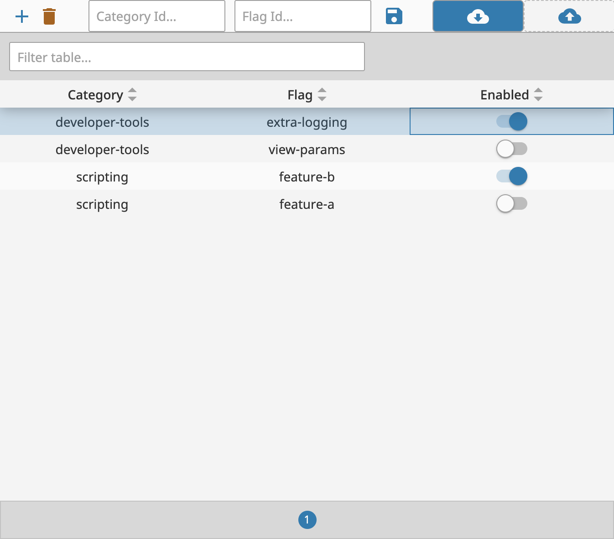

## Ignition Gateway Utilities
This repository is a collection of utilities for developing in Ignition. The utilities are designed to be run in parallel to the existing project, and can add features like config file access, feature flagging, and more.

### Installation
1. Download the latest release asset (`gateway-utilities.zip`) from the [releases page](https://github.com/design-group/ignition-gateway-utilities/releases)
2. Import the project into Ignition, either through the gateway webpage or while inside of another project.


### Functionality

#### [Config File Explorer](./docs/config-files.md)
Convenience functions for accessing config files on the gateway. This includes the ability to view, upload, download, and customize config files through a dedicated explorer.



#### [Feature Flagging](./docs/feature-flags.md)
Convenience functions for accessing feature flags on the gateway. This includes the ability to view, upload, download, and customize feature flags through a dedicated explorer.



#### [User Preferences](./docs/user-preferences.md)
Convenience functions for managing user preferences. This includes the ability to store and retrieve user preferences, default preferences for new users, session-based preference management, and individual preference updates. 

**NOTE** Named queries are given for both MSSQL and Postgres. Depending on your database type you will need to use the appropriate queries and ensure the location of the queries matches paths in the `User` script. For more information you can consult the [User Preferences documentation](./docs/user-preferences.md).

#### Multithreading
Convenience functions for running scripts in parallel. This includes the ability to run scripts in parallel with a set thread count. 

This could be used if multiple heavy operations need to happen before a user can move on. Executing the same script multiple times in parallel could resolve in a faster user experience.

##### Example
```python
General.Multithreading.wait_for_async_execution(
        func=myFunction, 
        kwargs_list=[
                {"myArg":"val1"}, 
                {"myArg":"val2"}
                ]
        )
```

#### Timed
Convenience functions for timing scripts. This includes the ability to time a script and log the results. This could be used to identify bottlenecks in a script. The results are logged to the gateway logs under the `General.Timed` logger.

##### Example
```python
# NOTE: function to collect timing report of all subfunctions
@General.Timed.collect_timing_report
def myFunction():
        sub_function()
        sub_function_1()

# NOTE: sub function to be timed
@General.Timed.execute_timed
def sub_function_1():
        #NOTE: do something

@General.Timed.execute_timed
def sub_function_2():
        #NOTE: do something
```
